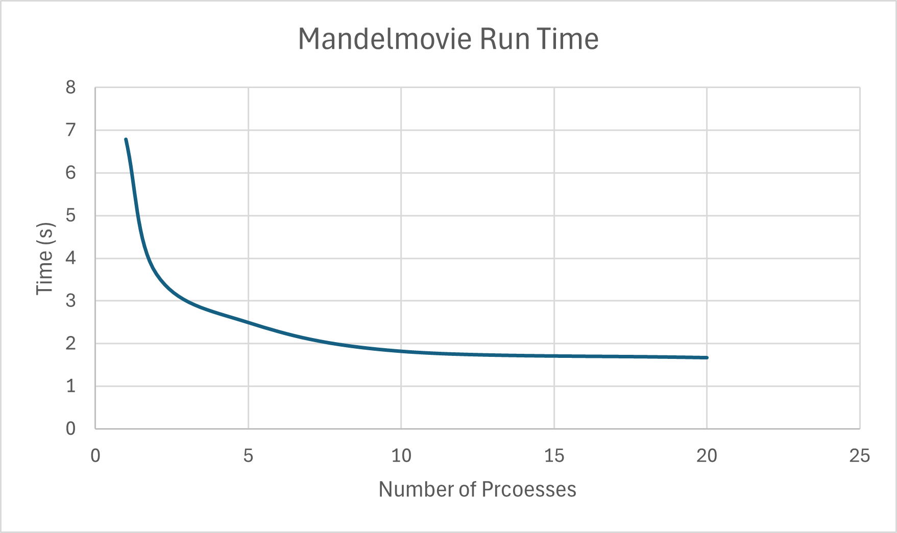

# System Programming Lab 11 & 12

Name: Ezan Hamdia
Section: 131

Lab 11: Multiprocessing

1. Implementation Overview

My program, mandelmovie, generates a 50-frame animation of the Mandelbrot set by using multiprocessing to speed up the rendering.

The program is written in C and managed with Git. The core logic is as follows:

It uses the getopt() function to parse a command-line argument -n, which specifies the maximum number of child processes to run simultaneously. If no argument is provided, it defaults to 1.

It runs a for loop from 0 to 49 (for the 50 frames). Inside the loop, it calculates the correct scale for the current frame to create a "zoom-in" effect.

To manage the process pool, it uses a counter, active_children. If the number of active children is already at the user-specified limit, the parent process calls wait(NULL) to pause and wait for any child to finish, freeing up a slot.

Once a slot is free, the parent uses fork() to create a new child.

The child process is responsible for rendering one frame. It converts the required parameters (x-coordinate, y-coordinate, and the new scale) into strings. It then uses execlp() to replace its own code with the provided ./mandel program, passing in all the calculated arguments.

The parent process increments the active_children counter after forking and immediately continues its loop to launch the next frame.

After the main loop has launched all 50 jobs, a final while loop calls wait(NULL) repeatedly until all remaining children have finished, ensuring the program only exits after all frames are generated.

2. Runtime Results

Here is a graph plotting the total runtime (in seconds) against the number of processes used to generate the 50 frames.

3. Discussion

The graph shows adding more processes to a program doesn't always speed up the run time. Although there was a signifcant difference going from 1 to 5 processes, we didn't really see that same change going from 10 to 20. This is probably because of the systems limited number of cores. Once all cores are in use, adding more processes just gives the system more overhead to deal with, rather than adding more speed. 

Lab 12: Multithreading Analysis

1. Implementation Overview
I defined a thread_data_t structure to pass multiple arguments (such as the image pointer, coordinate bounds, maximum iterations, and thread ID) to the worker function, as pthread_create only accepts a single argument.

I implemented a compute_thread function that acts as the worker routine. It divides the image height by the total number of threads to assign a specific strip of rows to each thread (vertical striping). This ensures that no two threads attempt to write to the same pixels simultaneously, avoiding race conditions without needing mutexes.

The compute_image function was updated to act as a manager. It loops to create the requested number of threads using pthread_create, waits for all of them to complete using pthread_join, and then returns.

The command line argument -t was added to both mandel.c (to set the thread count) and mandelmovie.c (to pass the thread count from the movie manager to the individual image generators).

2. Runtime Results
The following table shows the "real" runtime (in seconds) to generate 50 frames, varying both the number of processes (-n) and the number of threads per process (-t).

|# Processes (↓ n) / 
|# Threads (→ t) | **1** | **2** | **5** | **10** | **20** |
| **1** |       44.550s | 27.553s | 18.798s | 12.891s | 10.824s |
| **2** |        22.009s | 16.520s | 12.032s | 9.816s | 9.137s |
| **5** |        12.794s | 10.176s | 9.326s | 8.615s | 8.735s |
| **10** |       9.925s | 8.559s | 8.725s | 8.439s | 8.362s |
| **20** |       9.106s | 8.504s | 9.692s | 8.574s | 9.798s |

3. Discussion 

Which technique seemed to impact runtime more—multithreading or multiprocessing? Why do you think that is?

Based on my data, Multiprocessing had a greater impact on reducing runtime than Multithreading.

I believe this is because the Multiprocessing approach allows for complete independence between frames. One process can be writing its image to the disk while another process is simultaneously calculating the next frame using the CPU. This maximizes resource usage.

In contrast, the Multithreaded approach only parallelizes the calculation step. The program still has to stop and save the JPEG file sequentially for every single frame. This file I/O creates a 'serial bottleneck' that threads cannot speed up, preventing the multithreaded version from achieving the same efficiency as the multiprocess version.

Was there a "sweet spot" where optimal (minimal) runtime was achieved?

Yes, there was a sweet spot at 10 Processes and 20 Threads. This combination achieved the minimal runtime because it balanced the workload across my CPU cores without introducing too much overhead. When I increased the count beyond this, the runtime actually leveled off because the operating system had to spend too much juggling between all the active tasks instead of doing actual work.